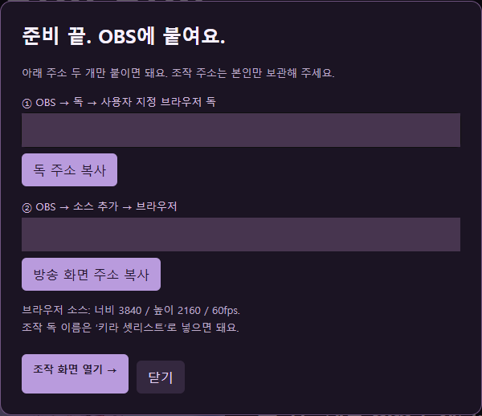
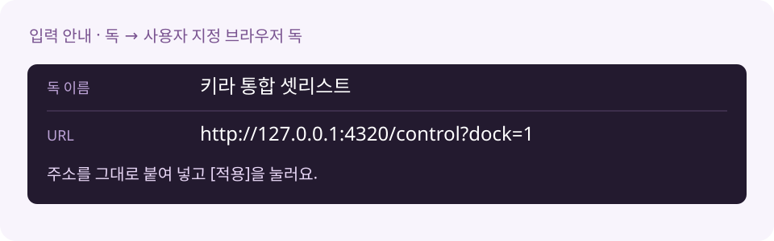
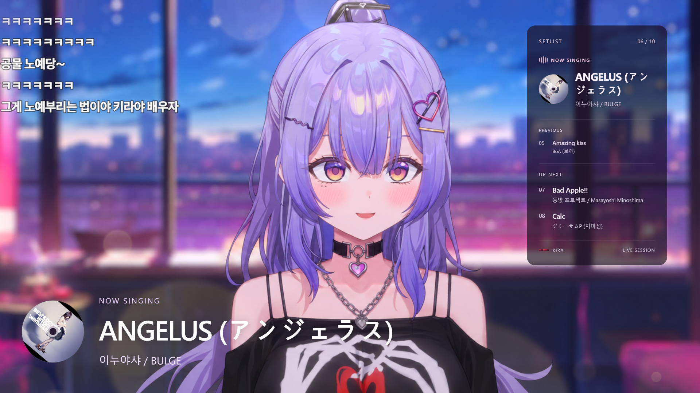
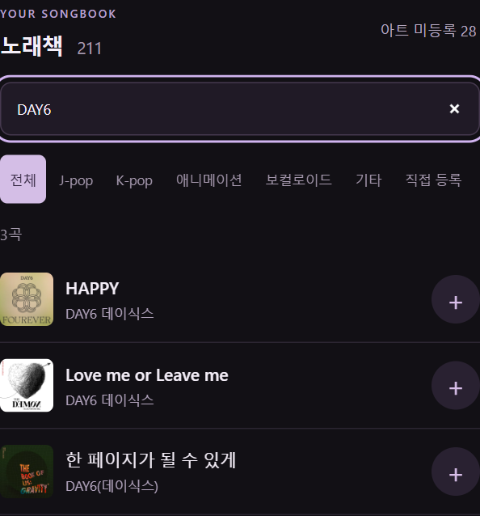
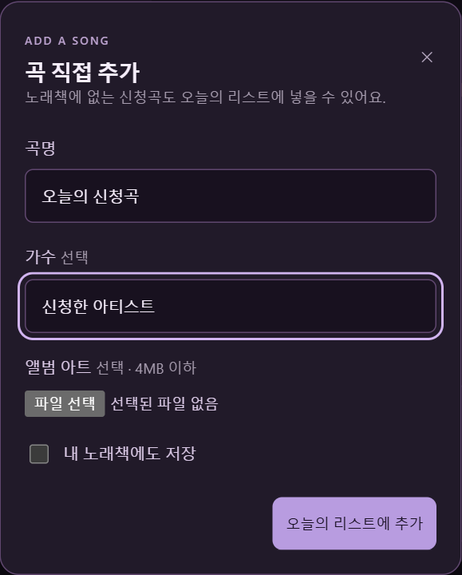
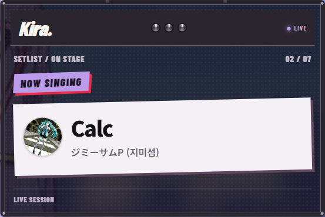
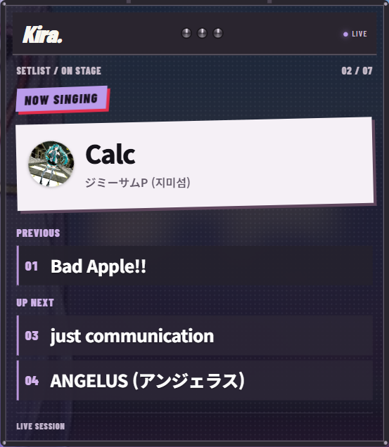

# Kira Setlist · 원본 + 앰프 DLC

**오늘 부를 곡을 담고, OBS 안에서 바로 넘겨요.** 웹으로 연결하거나 PC에 설치하는 방법 중 골라 쓸 수 있어요. 원본과 앰프 DLC 디자인을 모두 지원해요.

## 1. 설치 없이 웹으로 연결하기

**[키라 웹 셋리스트 열기](https://kira-setlist-web.vercel.app)** · **[웹 버전 그림 가이드](https://kira-setlist-web.vercel.app/guide)** · [OBS 조작 방식 미리보기](https://kira-setlist-web.vercel.app/demo)

첫 화면에서 **OBS 입력할 링크 발급하기**를 누르고, 생성된 주소를 OBS의 **사용자 지정 브라우저 독**과 **브라우저 소스**에 각각 붙여요. ZIP을 다운로드할 필요가 없어요. 남궁우가 실제 화면 캡처와 함께 한 단계씩 안내해요.

1. 위의 **키라 웹 셋리스트 열기** → **OBS 입력할 링크 발급하기**를 눌러요.
2. **독 주소 복사** → OBS **독 → 사용자 지정 브라우저 독**의 URL에 붙이고 적용해요.
3. **방송 화면 주소 복사** → OBS **소스 → + → 브라우저**의 URL에 붙여요. **너비 3840 / 높이 2160 / 60fps**로 설정하고 **변환 → 화면에 맞추기**를 눌러요.
4. 독의 **노래책 → +**로 담고, **리스트 → 부르기**를 눌러요. 다 부르면 **완료 · 다음 곡**이에요.

노래책·직접 추가·곡 넘기기·원본/DLC 전환을 사용할 수 있어요. 곡을 담으면 오늘의 리스트에 바로 추가돼요. 목록은 서버에 저장되고 조작 주소는 본인만 보관해요. 인터넷 연결이 필요해요. 다음 방송에도 같은 주소를 쓰면 목록과 설정을 이어서 사용해요.

웹 노래책은 **매일 Notion의 새 곡과 수정된 정보를 반영**하고, 삭제된 곡도 보존해요. 원본 앨범 아트·직접 등록한 곡·오늘의 리스트도 보존해요. 노션을 완전히 읽지 못하면 마지막으로 저장한 목록을 유지해요. 새 곡의 앨범 이미지가 없으면 기본 CD가 나와요.

웹 버전 소스와 배포 방법은 [web/README.md](web/README.md)에 있어요. PC에 설치해서 쓰고 싶다면 아래 2번을 선택해요. 웹과 로컬의 개인 리스트는 각각 저장돼요.

## 2. 내 PC에 설치하기 · 수동 ZIP

**[수동 ZIP 받기](https://github.com/Tenegumi/KiraSetlist/releases/download/v1.2.1/KiraSetlist-Manual-1.2.1.zip)** · **[남궁우의 로컬 그림 가이드](docs/INSTALL.md)** · [자동 설치를 원한다면](docs/AUTO-INSTALL.md)

1. 위의 **수동 ZIP**을 받고 **모두 압축 풀기**를 해요.
2. **도구 → 스크립트 → +**에서 폴더의 **kira-unified.lua**를 골라요.
3. **독 → 사용자 지정 브라우저 독**에 조작 주소를 붙여 넣어요.
4. **소스 → + → 브라우저**에 방송 주소와 **3840×2160 / 60fps**를 넣어요.
5. 소스를 **화면에 맞추기**로 맞추면 끝이에요.

주소와 클릭 순서는 **[그림 가이드](docs/INSTALL.md)**에서 복사하며 따라 해요. 설치 프로그램 없이 내가 쓰는 장면에 연결해요. Node는 ZIP에 들어 있고, 스크립트를 등록하면 다음부터는 **OBS만 켜면 돼요**. Windows용이며 OBS 32.2.2에서 출력했어요. 폴더는 연결한 뒤 옮기지 않아요.

## 오늘의 디자인은 버튼으로

**원본**은 반투명 셋리스트와 회전 CD, **앰프 DLC**는 컷아웃 앰프·붉은 하트 슬리브·반쯤 꺼낸 LP·보라색 사인이에요. DLC에서 곡이 바뀌면 LP와 곡 정보가 함께 튕기듯 움직여요. 이전 곡과 대기 곡은 제목만 보여 주고, 현재 곡에는 가수도 표시해요.

두 디자인은 **노래책·직접 추가한 곡·오늘의 리스트·현재 곡을 공유**해요. 크기와 투명도 같은 화면 설정은 각각 기억하니, 전환할 때마다 다시 맞출 필요 없어요.

원본 디자인도 보기

### 원본 · 곡 넘기는 모습

https://github.com/user-attachments/assets/4b3ef10a-344a-4b2a-a184-9fa94599d59b

### 앰프 DLC · 곡 넘기는 모습

https://github.com/user-attachments/assets/29bac96e-cbfd-44e3-8f25-73cd03f0e6a1

각 8초 · 1080p · 60fps예요. 영상의 재생 버튼을 누르면 움직임을 바로 볼 수 있어요.

## 방송 중에는 세 가지만 기억해요

 

- **담기:** 노래책에서 검색하고 곡 옆의 **+**를 눌러요. 없는 신청곡은 **+ 직접 추가**로 넣어요.
- **부르기:** 리스트에서 **부르기**를 누르면 방송 화면의 현재 곡이 바뀌어요.
- **넘기기:** 다 부르면 **완료 · 다음 곡**, 실수하면 **되돌리기**를 눌러요.

이미지가 없는 곡은 키라 기본 CD가 대신 나와요. 앨범 이미지를 눌러 후보를 고르거나 내 이미지를 등록할 수도 있어요.

## 화면은 내 방송에 맞춰요

 

| 맞출 수 있는 것 | 설정 |
| --- | --- |
| 보이는 곡 수 | 현재 곡만 / 이전 1곡 ON·OFF / 다음 0~5곡 |
| 오른쪽 창 | 크기·위치·투명도 / DLC 앰프 너비 |
| 왼쪽 하단 | 곡 정보 ON·OFF·크기 / DLC LP 슬리브·사인 색 |
| 앨범 아트 | 회전 ON·OFF, 한 바퀴 15~60초 |
| 방송 화면 | 두 디자인 모두 **3840×2160 소스 · 60fps**, 기존 캔버스에 맞춰 축소 |

표시를 줄여도 실제 곡 목록은 그대로 남아요. 음원 재생·자동 곡 감지·가사 싱크는 포함하지 않아요.

## 남궁우가 움직이며 알려줘요

https://github.com/user-attachments/assets/c6dcd067-af41-45ff-af69-3282bc8aa9e4

**재생 버튼을 눌러 같이 따라 해요.** 36장면 · 3분 36초 · Full HD 무음 영상이에요. **수동 ZIP → 스크립트 → 독 → 브라우저 소스**를 먼저 안내하고, 곡 추가와 화면 설정을 보여줘요. 자동 설치는 마지막 부분의 선택 사항이에요.

## 로컬 자동 설치를 원한다면 · 선택 사항

**[자동 설치 ZIP](https://github.com/Tenegumi/KiraSetlist/releases/download/v1.2.1/KiraSetlist-Integrated-1.2.1.zip)**을 풀고, OBS를 닫은 뒤 **설치하기.exe → 설치하고 OBS에 적용**을 눌러요. 새 장면 모음·조작 독·시작 스크립트를 등록하고 그 모음을 선택해요. 알려진 예전 키라 독은 정리하고 다른 독은 보존해요.

**방송 해상도·FPS·인코더·비트레이트·오디오·방송 키는 바꾸지 않아요.** OBS 설정은 먼저 백업해요. 다른 곳에 설치한 OBS는 **OBS 경로 선택**, 포터블은 **포터블 OBS**로 지정해요. [자동 설치 안내](docs/AUTO-INSTALL.md) · [변경 범위와 검증](docs/INSTALL-CHECK.md)

## 업데이트와 백업

수동판은 OBS를 닫고 **data**와 **public/artwork**를 백업해요. 새 ZIP으로 프로그램 파일을 바꾸고 개인 데이터는 그대로 유지해요. [자세한 수동 업데이트](docs/MANUAL.md#업데이트와-되돌리기)

자동 설치판은 같은 폴더에 새 ZIP의 **설치하기.exe**를 다시 실행해요. 개인 목록·직접 등록 곡·이미지·설정을 보존해요. 기본 경로는 **사용자 폴더/KiraSetlistUnified**이며 기존 단독판의 데이터도 첫 설치 때 가져와요.

로컬 ZIP의 노래책은 2026-10-05에 가져온 **211곡 스냅샷**이에요. 로컬판에는 웹의 매일 자동 동기화가 적용되지 않아요. 외부 앨범 이미지는 인터넷이 필요하고 로컬에서 직접 등록한 이미지는 PC에 저장돼요.

[개발·저장 구조](docs/DEVELOPMENT.md) · [변경 사항](docs/RELEASE-NOTES.md)
