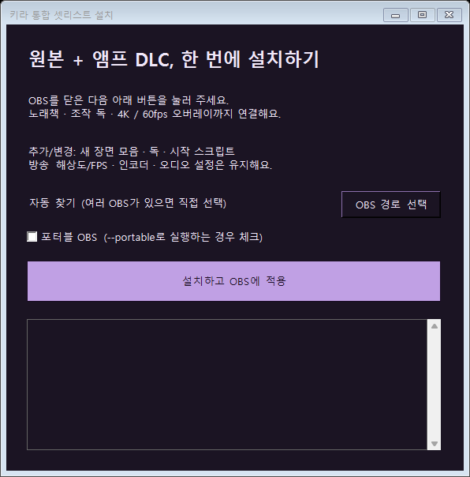

# 버튼으로 자동 설치하기 · 선택 사항

OBS는 익숙해도 설치 파일이 낯설 수 있어요. **ZIP을 풀고 버튼 하나를 누르면**, 그다음부터는 OBS 안에서 조작할 수 있어요.

[설치 ZIP 받기](https://github.com/Tenegumi/KiraSetlist/releases/download/v1.2.2/KiraSetlist-Integrated-1.2.2.zip) · [동영상으로 보기](https://github.com/Tenegumi/KiraSetlist/releases/download/v1.2.1/kira-integrated-tutorial.mp4)

먼저 추천하는 방법은 [직접 연결하는 수동 설치](INSTALL.md)예요. 설치 프로그램 없이 연결하고 싶다면 **[수동 ZIP과 그림 안내](MANUAL.md)**를 골라 주세요. 자동 설치가 무엇을 바꾸는지는 [설치 검증 안내](INSTALL-CHECK.md)에 정리했어요.

## 1. 방송이 끝나면 OBS를 닫아요

방송·녹화가 끝났는지 확인하고 OBS를 완전히 닫아 주세요. 설치 프로그램은 OBS가 열려 있으면 먼저 종료해 달라고 안내해요.

## 2. 설치 ZIP을 받고 압축을 풀어요

위의 **설치 ZIP 받기**를 눌러요. 받은 파일 이름은 **KiraSetlist-Integrated-1.2.2.zip**이에요. ZIP을 우클릭하고 **모두 압축 풀기**를 해 주세요.

압축을 푼 폴더에 **설치하기.exe**와 **app 폴더**가 함께 있어야 해요. ZIP 안에서 exe만 따로 꺼내 실행하면 안 돼요. GitHub의 **Source code**는 설치 파일과 달라요.

## 3. 설치 버튼을 눌러요

**설치하기.exe → 설치하고 OBS에 적용**을 누르고 완료 안내를 기다려 주세요.

OBS가 다른 드라이브에 있거나 여러 개라면 **OBS 경로 선택**에서 사용하는 `obs64.exe`를 골라요. 포터블 파일 표식은 자동 인식하며, `--portable`로 여는 OBS는 **포터블 OBS**에도 체크해요.

프로그램과 실행에 필요한 Node, OBS 자동 시작 스크립트, 조작 독, 4K 오버레이가 함께 설치돼요. 별도로 브라우저나 터미널을 켤 필요 없어요.

설치가 끝나면 OBS가 열려요. 장면 모음은 **키라 통합 셋리스트 (원본 + DLC)**예요. 이전 방송 장면을 바탕으로 복사한 모음이며 기존 모음도 남아 있어요. 다른 곳에 설치한 OBS는 직접 열고 이 장면 모음을 선택해 주세요.

예전 **키라 셋리스트 / 키라 앰프 DLC** 독 등록은 통합 독으로 정리해요. 기존 단독 앱의 파일과 장면 모음은 남아요. OBS의 방송 해상도·FPS·인코더·오디오·방송 키는 바꾸지 않아요.

설치가 끝나면 [곡 추가와 화면 설정](INSTALL.md#5-원본--앰프-dlc를-골라요)을 확인해요.
