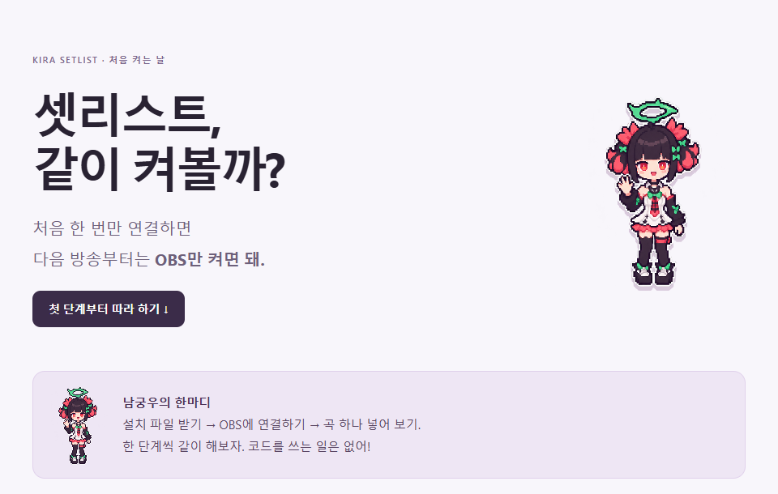

# 셋리스트, 남궁우랑 같이 켜볼까?

[움직이는 도트 남궁우 가이드와 영상](tutorial-motion/README.md)

> **남궁우:** 처음 한 번만 연결하면 다음 방송부터는 OBS만 켜면 돼. 설치 → OBS 연결 → 첫 곡 넣기, 한 단계씩 따라와 줘!

## 1. 이 설치 파일 하나만 받아 줘

[**설치 파일 받으러 가기**](https://github.com/Tenegumi/KiraSetlist/releases/latest)

페이지 아래 **Assets**를 열고 **KiraSetlist-OBS.zip**을 눌러 줘. **Source code**는 개발용 파일이야.

받았으면 **다운로드 폴더에 ZIP 파일이 있는지** 확인하고 다음으로!

## 2. 압축을 풀고 두 번 클릭

1. 받은 ZIP을 **마우스 오른쪽 버튼**으로 눌러.
2. **모두 압축 풀기**를 고르고, 새로 생긴 폴더를 열어.
3. 그 안에 있는 **install.cmd**를 **두 번 클릭**해 줘.
4. 설치가 끝나면 **설치 폴더의 OBS-guide.html**을 열어 줘.

> **남궁우:** 추가 프로그램은 따로 설치하지 않아도 돼. 안내서에는 네 PC에 맞는 파일 위치와 주소가 나와. 아래 OBS 연결은 그 안내서를 열고 따라 하면 편해!

기본 설치 폴더는 사용자 폴더 안의 **KiraSetlist**야. 파일 위치가 헷갈리면 설치가 끝날 때 나온 위치를 확인해 줘.

## 3. OBS를 켤 때 같이 켜지게 연결하기

OBS 위쪽에서 **도구 → 스크립트 → +**를 차례로 눌러 줘.

설치 폴더 안의 **kira-setlist.lua**를 골라. 파일 내용은 건드릴 필요 없어!

**잘 된 모습:** 스크립트 목록에 **kira-setlist.lua**가 보여.

## 4. 오른쪽에 조작 칸 붙이기

OBS 위쪽에서 **독 → 사용자 브라우저 독**을 열어 줘.

- **이름**에는 `키라 셋리스트`
- **주소**에는 설치 폴더의 안내서에 나온 주소를 **통째로 복사해서 붙여 넣기**
- **적용**을 누르기

열린 창의 제목을 잡아 OBS 오른쪽으로 끌면 고정할 수 있어. 독 사이 경계선을 끌면 너비도 바뀌어.

> **남궁우:** 위쪽에 **연결됨**이 보이면 잘 됐어! 여기는 네가 조작하는 칸이야. 시청자에게 이 조작 화면이 그대로 나가지는 않아.

## 5. 시청자에게 보여줄 화면 올리기

**도구 → 스크립트**로 돌아가 **kira-setlist.lua**를 선택해 줘.

오른쪽의 **현재 장면에 오버레이 추가**를 누르면 OBS 소스 목록에 **키라 셋리스트 오버레이**가 생겨.

이 소스를 **캐릭터와 배경보다 위로** 올려 줘. 그래야 화면에 보여!

**잘 된 모습:** 소스 목록에 새 오버레이가 있어. 이제 곡 하나를 넣어 보자.

## 6. 첫 곡 넣고 부르기

1. **노래책** 탭에서 곡명이나 가수를 검색해. 초성도 돼.
2. 곡 옆 **+**를 누르면 오늘의 리스트에 들어가.
3. **리스트** 탭으로 돌아가 곡의 **부르기**를 눌러 줘.

> **남궁우:** 방송 화면에 곡명과 회전하는 앨범 아트가 보이면 준비 끝! 음원은 평소 쓰던 방식으로 재생하면 돼.

다 부르면 **완료 · 다음 곡**. 잘못 누르면 **되돌리기**. 순서는 드래그하거나 위·아래 화살표로 바꿀 수 있어.

### 노래책에 없는 신청곡은?

**리스트 → + 직접 추가**에서 **곡명**을 적어 줘. 가수와 이미지는 넣고 싶을 때만 넣으면 돼.

다음 방송에도 찾고 싶으면 **내 노래책에도 저장**을 켜 줘.

## 7. 내 방송에 맞게 꾸미기

**화면 설정** 탭에서 하나씩 바꿔 보자.

- **표시 구성:** 공간을 적게 쓰려면 **현재 곡만**. 앞뒤 곡도 보여주려면 **이전 1곡 + 현재 곡 + 다음 2곡**.
- **우측 패널 크기:** **65~75%**부터 시작해서 방송 화면을 보며 맞춰 봐.
- **오른쪽·위쪽 여백:** 패널 위치를 옮길 수 있어.
- **셋리스트 배경:** 숫자를 낮추면 배경이 더 비쳐 보여.
- **좌측 하단 곡 정보:** 왼쪽 아래 곡 정보를 켜고 끌 수 있어.
- **앨범 아트 회전:** 회전을 켜고 끄거나 속도를 바꿀 수 있어.

 

> **남궁우:** 설정은 자동으로 저장돼. 마음에 들게 맞췄으면 끝! 다음 방송은 OBS만 켜고 곡을 넣으면 돼.

## 잠깐 막혔다면

**계속 연결 중이야:** 도구 → 스크립트에 파일이 있는지 보고 **연결 다시 시작**을 눌러 줘.

**곡이 안 보여:** 리스트에서 **부르기**를 눌렀는지, 소스의 눈 아이콘이 켜져 있는지 확인해. 오버레이는 배경보다 위에 있어야 해.

**예전 목록도 같이 보여:** 이전 셋리스트 소스를 꺼 줘. 배경 이미지 자체에 찍힌 목록이라면 목록 없는 배경으로 바꿔야 해.

**앨범 아트가 기본 CD야:** 이미지가 없거나 불러오지 못했을 때 보여주는 정상 대체 이미지야. 곡 옆 이미지를 눌러 직접 넣을 수도 있어.

## 업데이트·백업도 간단히

업데이트할 땐 **OBS를 먼저 닫고**, 새 ZIP을 풀어 **install.cmd**를 다시 실행해 줘. 같은 설치 폴더를 쓰면 개인 곡과 설정이 남아.

백업은 설치 폴더의 **data**와 **public/artwork**를 함께 복사하면 돼. 복원할 때도 OBS를 닫고 원래 자리로 돌려놓으면 돼.

[**움직이는 도트 영상용 이미지·대사 안내**](tutorial-motion/README.md)

---

방송 예시는 제공받은 스크린샷, 조작 화면은 실제 앱 캡처야. 남궁우 도트 캐릭터는 제공된 캐릭터를 바탕으로 만든 GPT 이미지야. Windows용이며 OBS 32.2.2에서 연결·사용을 확인했어.
