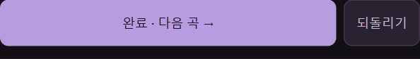
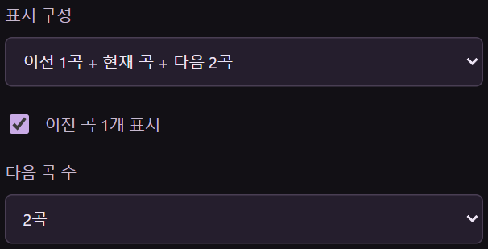
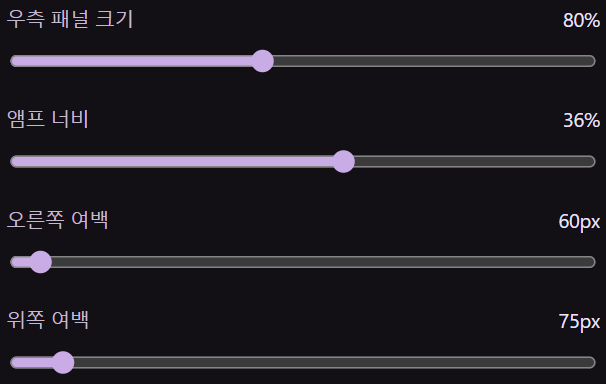
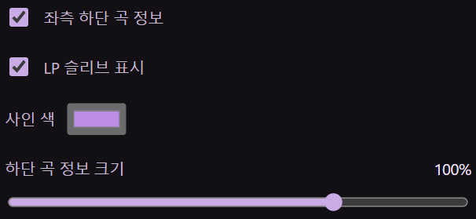
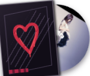
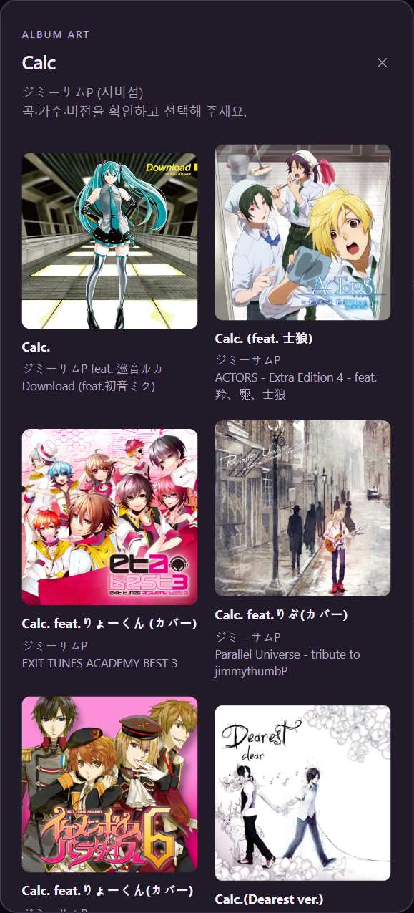

# 남궁우와 같이, OBS에 직접 붙여요

**[수동 ZIP 받기](https://github.com/Tenegumi/KiraSetlist/releases/download/v1.2.1/KiraSetlist-Manual-1.2.1.zip)**

원본과 앰프 DLC 기능은 같아요. 이 ZIP에는 설치 프로그램이 없어요. 내가 사용하는 장면에 스크립트·독·방송 소스를 하나씩 등록하는 방식이에요. OBS는 컴퓨터에 설치되어 있어야 해요.

## 1. 폴더를 자리 잡게 해요

ZIP을 받고 **모두 압축 풀기**를 눌러요. 예를 들어 문서 안의 `KiraSetlistManual` 폴더에 두면 돼요. 폴더 안에 `kira-unified.lua`, `runtime`, `public`, `data`가 함께 있는지 확인해요. 등록한 뒤에는 이 폴더를 이동하거나 삭제하지 않아요.

Node 실행 파일도 ZIP에 들어 있어요. 따로 Node를 설치하거나 인터넷 창을 켤 필요 없어요. 이 단계에서 OBS 설정은 바뀌지 않아요.

## 2. OBS가 켤 때 함께 실행되게 해요

OBS의 **도구 → 스크립트 → +**를 누르고, 방금 압축을 푼 폴더 안의 **kira-unified.lua**를 선택해요. 등록하는 순간 셋리스트가 실행되고, 다음부터는 이 장면 모음을 열면 OBS와 함께 실행돼요.

포터블 OBS도 같은 방법이에요. 스크립트는 현재 선택한 장면 모음에 저장되므로 다른 모음을 쓸 때는 거기에도 등록해요. 예전 단독판 Lua가 있다면 통합판을 사용하는 장면 모음에서는 예전 키라 Lua만 빼 주세요.

## 3. 조작 독을 붙여요

OBS의 **독 → 사용자 지정 브라우저 독**을 열어요. 독 이름은 **키라 통합 셋리스트**, URL은 아래 주소를 그대로 붙여 넣고 **적용**해요.

`http://127.0.0.1:4320/control?dock=1`

새 독의 제목줄을 원하는 자리로 끌어 붙이면 끝이에요. 아래는 연결된 조작 패널의 실제 화면이에요. 조작 독은 방송에 나오지 않아요.

## 4. 방송에 보일 소스를 넣어요

셋리스트를 보여 줄 장면을 선택하고 **소스 → + → 브라우저**를 눌러요. 새 소스 이름은 **키라 통합 셋리스트 오버레이**로 해요.

| 항목 | 넣을 값 |
| --- | --- |
| 로컬 파일 | 체크 해제 |
| URL | `http://127.0.0.1:4320/overlay` |
| 너비 / 높이 | **3840 / 2160** |
| 사용자 지정 프레임 레이트 사용 | 체크 · **60 FPS** |
| 소스가 보이지 않을 때 종료 | 체크 해제 |
| 사용자 지정 CSS | 기본값 유지 (배경을 투명하게 하는 기본 CSS) |

확인을 누른 뒤 소스를 우클릭하고 **변환 → 화면에 맞추기**를 눌러요. 방송 캔버스가 1920×1080이면 4K 소스가 절반 크기로 맞춰져요. 장면의 다른 소스보다 위에 두어야 셋리스트가 보여요.

## 5. 원본 / 앰프 DLC를 골라요

OBS의 **키라 통합 셋리스트** 독에서 위쪽 버튼을 눌러요.

원본과 DLC는 노래책·오늘의 리스트·현재 곡을 공유해요. 크기·투명도·표시 곡 수는 디자인별로 기억해요.

조작 독이 안 보이면 위의 **3. 조작 독을 붙여요** 단계에서 이름과 URL을 확인해 주세요. 독 제목을 끌어 원하는 자리에 붙이고, 경계선을 끌어 너비를 맞춰도 돼요. 조작 독은 방송에 나오지 않아요.

## 6. 오늘 부를 곡을 담아요

**노래책** 탭에서 곡명·가수·초성으로 검색한 다음 곡 옆 **+**를 눌러요. 장르 버튼으로 찾을 곡을 좁힐 수도 있어요.

없는 신청곡은 **리스트 → + 직접 추가**를 눌러요. 곡명은 꼭 넣고, 가수와 앨범 이미지는 필요할 때 넣으면 돼요.

**내 노래책에도 저장**을 켜면 다음 방송에서도 검색할 수 있어요. 끄면 오늘의 리스트에만 담아요. 이미지가 없으면 키라 기본 CD로 표시해요.

## 7. 부르기 → 완료 · 다음 곡

리스트에서 **부르기**를 눌러 현재 곡을 정해요. 노래가 끝나면 **완료 · 다음 곡**, 실수하면 **되돌리기**를 눌러요.

대기 곡은 드래그하거나 **↑ ↓**로 순서를 바꿀 수 있어요. 이 도구는 화면에 곡 정보를 보여 주며, 노래를 재생하거나 자동으로 듣고 감지하지 않아요.

## 8. 오른쪽 창에 몇 곡을 띄울까요?

**화면 설정 → 표시 구성**에서 고르세요. 더 세밀하게 정하려면 **이전 곡 1개 표시**와 **다음 곡 수**를 조절해요. 다음 곡은 0~5개까지 표시할 수 있어요.

 

DLC의 이전·대기 곡에는 **번호와 제목만** 나와요. 현재 곡에는 앨범 아트·제목·가수도 표시해요. 화면에서 숨긴 곡도 실제 리스트에는 남아요.

## 9. 크기와 투명도를 맞춰요

**우측 패널 크기**로 창을 줄이고, DLC에서는 **앰프 너비**도 조절해요. **오른쪽 여백·위쪽 여백**으로 위치를 맞춰요. 처음 배치로 돌아가려면 **크기·위치 기본값으로**를 눌러 주세요.

**셋리스트 배경**은 0~100%로 조절해요. 낮출수록 배경이 더 비쳐요. 실제 방송 배경 위에서 제목이 잘 읽히는지 확인해 주세요.

## 10. 왼쪽 정보와 회전도 내 취향대로

**좌측 하단 곡 정보**로 전체를 켜고 끌 수 있어요. **하단 곡 정보 크기**는 따로 조절해요. DLC의 **LP 슬리브 표시**와 **사인 색**도 여기 있어요.

**앨범 아트 회전**을 켜고 한 바퀴 시간을 15~60초로 정해요. 슬리브의 붉은 하트는 키라 의상에서 가져온 디자인이에요.

## 11. 앨범 이미지를 바꾸려면

노래책이나 리스트에서 **작은 앨범 이미지**를 눌러요. 후보를 확인해 선택하거나 **내 이미지 등록**으로 PNG·JPG·WebP를 올릴 수 있어요. 파일은 4MB까지예요.

외부 앨범 이미지에는 인터넷이 필요해요. 이미지가 없는 곡이나 불러오지 못한 이미지는 기본 CD로 대신 표시해요.

## 다음 방송·업데이트·백업

다음부터는 이 장면 모음을 사용하는 OBS만 켜 주세요. 현재 곡·목록·설정은 자동 저장돼요. 수동 업데이트는 **OBS 종료 → data와 public/artwork 백업 → 프로그램 파일 교체**예요. 기존 데이터 폴더를 새 빈 폴더로 덮어쓰지 않아요. [자세한 업데이트와 되돌리기](MANUAL.md#업데이트와-되돌리기)

## 잘 안 보이면 여기부터

| 상황 | 이렇게 확인해요 |
| --- | --- |
| 설치 버튼이 OBS를 닫으라고 해요 | 방송·녹화를 종료하고 OBS를 완전히 닫은 뒤 다시 눌러요. |
| 조작 독이 없어요 | **독 → 키라 통합 셋리스트**를 켜고, 사용 중인 장면 모음에 스크립트가 등록되어 있는지 확인해요. |
| 연결 중에서 멈춰요 | **도구 → 스크립트**의 `kira-unified.lua`에서 **연결 다시 시작**을 눌러요. 폴더를 옮겼다면 스크립트를 새 위치에서 다시 등록해요. |
| 내 방송 위에 안 보여요 | 소스 목록에서 **키라 통합 셋리스트 오버레이**를 캐릭터·배경 위에 올리고 눈 아이콘을 켜요. 다른 장면에는 **기존 소스 추가**로 붙여요. |
| 원본 배경이 검게 보여요 | 현재 통합 ZIP으로 업데이트한 뒤 브라우저 소스 속성의 **현재 페이지의 캐시를 새로고침**을 눌러요. 방송 소스 URL에는 `preview=1`을 붙이지 않아요. |
| 글자가 흐려 보여요 | 브라우저 소스 너비 **3840**, 높이 **2160**, 사용자 지정 FPS **60**을 확인해요. 창 크기는 앱의 화면 설정에서 맞춰요. |
| 전체 방송이 30fps예요 | 설치는 방송 FPS를 바꾸지 않아요. 60fps 방송을 원하면 **설정 → 비디오 → 일반 FPS 값 60**을 직접 선택해요. |
| 예시 캐릭터 배경을 숨기고 싶어요 | 예시 배경 소스가 있으면 숨기고 실제 방송 배경·캐릭터 소스를 사용해요. 오버레이 자체는 투명해요. |

노래책은 2026-10-05에 가져온 스냅샷이에요. Notion을 수정해도 자동으로 반영되지는 않아요. 설치본에 개인 목록이나 OBS 비밀번호는 포함하지 않아요.

[가이드 영상 보기](tutorial-motion/README.md) · [소개로 돌아가기](../README.md)

## 버튼으로 연결하고 싶다면 · 두 번째 방법

[자동 설치 안내](AUTO-INSTALL.md)를 골라 주세요. 새 장면 모음과 독을 자동 등록하지만 방송 FPS와 인코더 설정은 바꾸지 않아요. [변경 범위와 검증](INSTALL-CHECK.md)
