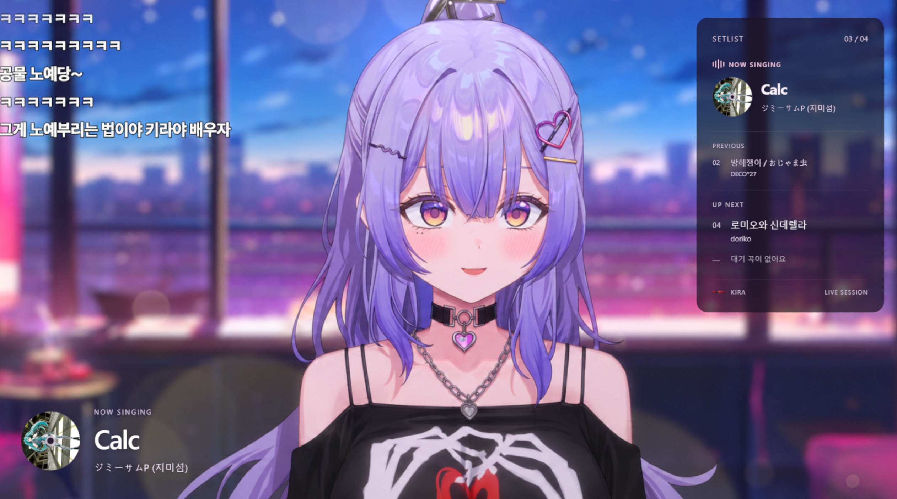
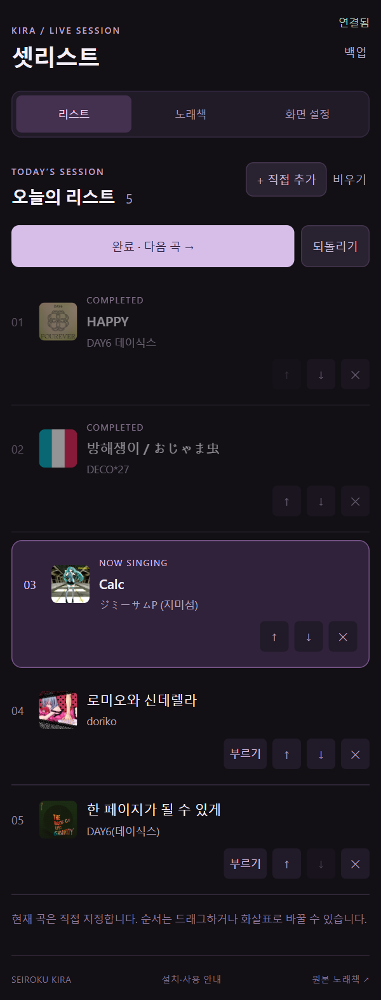
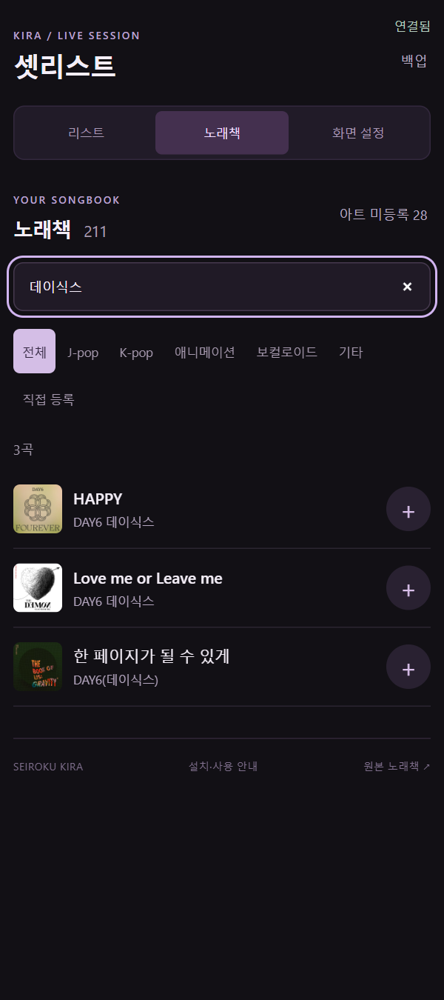
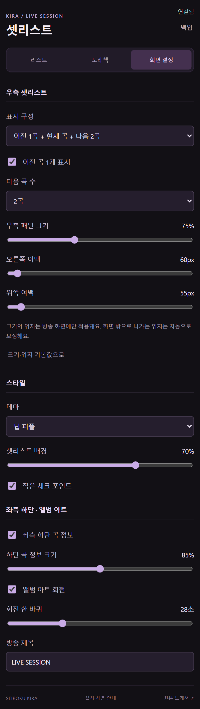
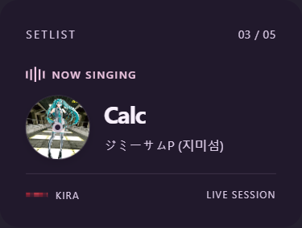
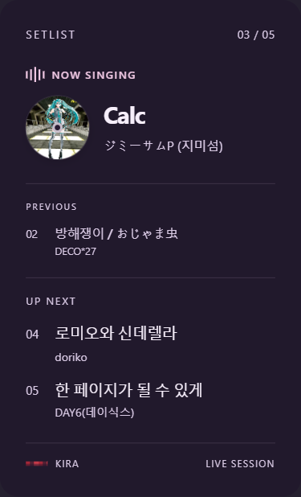

# 스크린샷으로 보는 설치·사용 가이드

우측 반투명 셋리스트와 좌측 하단 곡 정보는 각각 조절할 수 있습니다. 앨범 아트는 현재 부르는 곡을 지정하면 회전합니다.

## 1. 다운로드하고 설치

1. 이 저장소의 **Releases → 최신 버전 → Assets**에서 **KiraSetlist-OBS.zip**을 받습니다. **Source code** ZIP은 실행에 필요한 런타임이 없는 개발용 파일입니다.
2. ZIP을 전부 압축 해제합니다.
3. 압축을 푼 `KiraSetlist-OBS` 폴더에서 **install.cmd**를 실행합니다.
4. 설치 폴더의 **OBS-guide.html**을 엽니다. 해당 PC에 맞는 파일 경로와 독 주소를 복사할 수 있습니다.

기본 설치 폴더는 `%USERPROFILE%\KiraSetlist`입니다. Node 런타임을 포함하므로 따로 설치할 필요가 없습니다. Windows용이며 OBS 32.2.2에서 확인했습니다.

## 2. OBS에 처음 한 번 등록

| 순서 | OBS에서 열 곳 | 넣을 파일·주소 |
| --- | --- | --- |
| 자동 실행 | **도구 → 스크립트 → +** | 설치 폴더의 `kira-setlist.lua` |
| 조작 패널 | **독 → 사용자 브라우저 독** | 이름 `키라 셋리스트`, 주소는 설치 안내의 `dock-launcher.html` **file:/// 주소** |
| 방송 오버레이 | 등록한 스크립트의 설정 | **현재 장면에 오버레이 추가** 버튼 |

조작 독 제목을 끌어 OBS 오른쪽에 고정합니다. 소스 목록에서 **키라 셋리스트 오버레이**를 배경·캐릭터 소스보다 위로 올립니다. 이후에는 **OBS만 실행**하면 됩니다.

실제 앱의 리스트 탭 캡처입니다. OBS에서는 이 화면이 오른쪽 독에 표시됩니다. 조작 패널은 방송에 노출되지 않습니다.

### 오버레이를 직접 등록할 경우

**소스 + → 브라우저 → 로컬 파일**에서 설치 폴더의 `overlay-launcher.html`을 고릅니다. 너비 **1920**, 높이 **1080**, FPS **30**. **보이지 않을 때 소스 종료**는 끕니다. `preview=1` 주소는 참고 배경이 들어가는 개발용이므로 방송 소스로 쓰지 않습니다.

## 3. 곡 추가와 방송 진행

1. **노래책** 탭에서 곡명·가수·초성으로 검색합니다.
2. 곡 옆 **+**를 눌러 오늘의 리스트에 추가합니다.
3. **리스트** 탭에서 부를 곡의 **부르기**를 누릅니다.
4. 노래가 끝나면 **완료 · 다음 곡**을 누릅니다. 잘못 눌렀으면 **되돌리기**를 사용합니다.

곡 순서는 드래그하거나 위·아래 화살표로 바꿉니다. 이 앱은 음원을 재생하거나 자동 감지하지 않으며, 현재 곡은 직접 지정합니다.

## 4. 노래책에 없는 신청곡

**리스트 → + 직접 추가**에서 곡명을 입력합니다. 가수와 앨범 아트는 선택 사항입니다. **내 노래책에도 저장**을 켜면 다음 방송에도 검색할 수 있습니다. 이미지를 넣지 않거나 아트를 불러올 수 없으면 키라 기본 CD로 표시합니다.

## 5. 표시 곡 수·크기·반투명도

| 설정 | 선택할 수 있는 값 |
| --- | --- |
| 표시 구성 | 현재 곡만 / 현재 곡 + 다음 2곡 / 이전 1곡 + 현재 곡 + 다음 2곡 |
| 직접 설정 | 이전 1곡 ON/OFF, 다음 0~5곡 |
| 우측 패널 크기 | 50~120%, 기본 75% |
| 위치 | 오른쪽·위쪽 여백 |
| 좌측 하단 정보 | ON/OFF, 크기 50~120% |
| 스타일 | 딥 퍼플 / 라벤더 글라스, 불투명도 0~100%, 작은 체크 포인트 |
| 디스크 | 회전 ON/OFF, 한 바퀴 15~60초 |

 

왼쪽은 **현재 곡만**, 오른쪽은 **이전 1곡 + 현재 곡 + 다음 2곡**입니다. 표시 수를 줄이면 패널 높이도 줄어듭니다. 설정을 바꿔도 실제 곡 리스트는 그대로 유지됩니다.

방송 패널은 **화면 설정**에서 줄이고, OBS 조작 독의 너비는 독 경계선을 끌어서 조절합니다. **크기·위치 기본값으로**는 표시 곡 수를 유지하면서 배치만 초기화합니다.

## 6. 업데이트·백업

업데이트할 때는 **OBS를 닫은 뒤** 새 ZIP을 풀어 `install.cmd`를 다시 실행합니다. 같은 설치 경로를 사용하면 개인 곡·리스트·설정·등록 이미지가 보존됩니다.

백업은 설치 폴더의 **data**와 **public/artwork**를 함께 복사합니다. 복원도 OBS를 닫은 상태에서 합니다.

## 자주 겪는 문제

| 증상 | 확인할 것 |
| --- | --- |
| 연결 중에서 멈춤 | **도구 → 스크립트**에서 `kira-setlist.lua`가 등록되어 있는지 확인하고 **연결 다시 시작**을 누릅니다. |
| 조작 독이 열리지 않음 | 설치 후 `OBS-guide.html`에 표시된 **file:/// 독 주소**를 사용했는지 확인합니다. |
| 오버레이가 안 나옴 | 브라우저 소스 눈 아이콘, 소스 순서, 현재 곡 지정 여부를 확인합니다. |
| 기존 리스트가 같이 보임 | 이전 셋리스트 소스를 끕니다. 배경 이미지에 박힌 UI는 그 이미지 자체를 교체해야 합니다. |
| 앨범 아트가 기본 CD로 나옴 | 미등록·불러오기 실패 시 정상 대체 표시입니다. 곡 옆 이미지를 눌러 등록할 수 있습니다. |

방송 예시는 제공받은 스크린샷입니다. 조작·설정 캡처는 동일한 앱을 별도 테스트 환경에서 실행한 화면이며, OBS 메뉴 창을 촬영한 이미지는 아닙니다.
