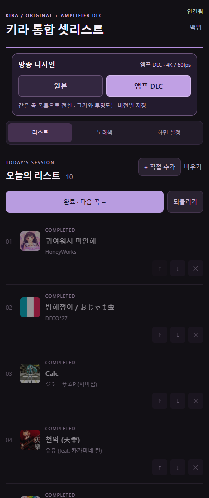
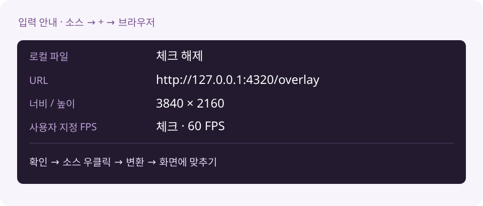
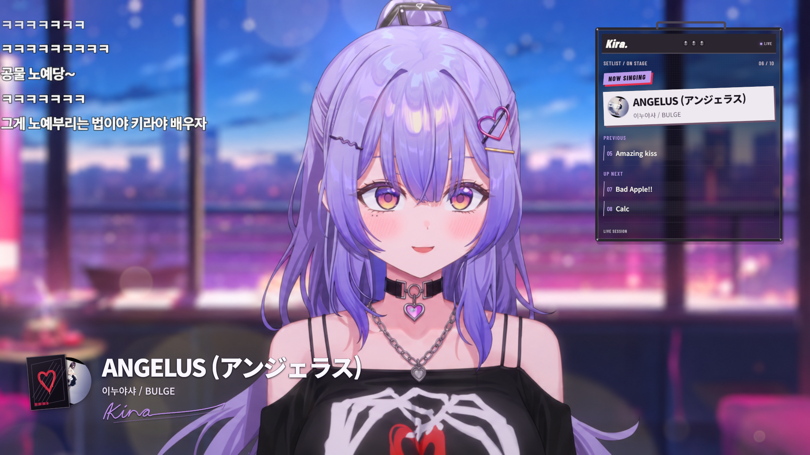

# 설치 버튼 없이, OBS에 직접 붙여요

**[수동 ZIP 받기](https://github.com/Tenegumi/KiraSetlist/releases/download/v1.2.2/KiraSetlist-Manual-1.2.2.zip)**

원본과 앰프 DLC 기능은 같아요. 이 ZIP에는 설치 프로그램이 없어요. 내가 사용하는 장면에 스크립트·독·방송 소스를 하나씩 등록하는 방식이에요. OBS는 컴퓨터에 설치되어 있어야 해요.

## 1. 폴더를 자리 잡게 해요

ZIP을 받고 **모두 압축 풀기**를 눌러요. 예를 들어 문서 안의 `KiraSetlistManual` 폴더에 두면 돼요. 폴더 안에 `kira-unified.lua`, `runtime`, `public`, `data`가 함께 있는지 확인해요. 등록한 뒤에는 이 폴더를 이동하거나 삭제하지 않아요.

Node 실행 파일도 ZIP에 들어 있어요. 따로 Node를 설치하거나 인터넷 창을 켤 필요 없어요. 이 단계에서 OBS 설정은 바뀌지 않아요.

## 2. OBS가 켤 때 함께 실행되게 해요

OBS의 **도구 → 스크립트 → +**를 누르고, 방금 압축을 푼 폴더 안의 **kira-unified.lua**를 선택해요. 등록하는 순간 셋리스트가 실행되고, 다음부터는 이 장면 모음을 열면 OBS와 함께 실행돼요.

포터블 OBS도 같은 방법이에요. 스크립트는 현재 선택한 장면 모음에 저장되므로 다른 모음을 쓸 때는 거기에도 등록해요. 예전 단독판 Lua가 있다면 통합판을 사용하는 장면 모음에서는 예전 키라 Lua만 빼 주세요.

## 3. 조작 독을 붙여요

OBS의 **독 → 사용자 지정 브라우저 독**을 열어요. 독 이름은 **키라 통합 셋리스트**, URL은 아래 주소를 그대로 붙여 넣고 **적용**해요.

`http://127.0.0.1:4320/control?dock=1`

새 독의 제목줄을 원하는 자리로 끌어 붙이면 끝이에요. 아래는 연결된 조작 패널의 실제 화면이에요. 조작 독은 방송에 나오지 않아요.

## 4. 방송에 보일 소스를 넣어요

셋리스트를 보여 줄 장면을 선택하고 **소스 → + → 브라우저**를 눌러요. 새 소스 이름은 **키라 통합 셋리스트 오버레이**로 해요.

| 항목 | 넣을 값 |
| --- | --- |
| 로컬 파일 | 체크 해제 |
| URL | `http://127.0.0.1:4320/overlay` |
| 너비 / 높이 | **3840 / 2160** |
| 사용자 지정 프레임 레이트 사용 | 체크 · **60 FPS** |
| 소스가 보이지 않을 때 종료 | 체크 해제 |
| 사용자 지정 CSS | 기본값 유지 (배경을 투명하게 하는 기본 CSS) |

확인을 누른 뒤 소스를 우클릭하고 **변환 → 화면에 맞추기**를 눌러요. 방송 캔버스가 1920×1080이면 4K 소스가 절반 크기로 맞춰져요. 장면의 다른 소스보다 위에 두어야 셋리스트가 보여요.

## 5. 곡을 담고, 디자인을 골라요

독에서 **노래책 → 곡 검색 → +**로 곡을 담고 **부르기**를 눌러요. 원본 / 앰프 DLC 버튼으로 디자인도 골라요. 오른쪽 크기와 투명도는 **화면 설정**에서 맞출 수 있어요.

방송을 60fps로 송출하려면 **OBS 설정 → 비디오 → 일반 FPS 값 60**을 직접 선택해요. 셋리스트는 이 설정을 자동으로 바꾸지 않아요. OBS가 30fps면 출력도 30fps로 제한돼요.

## 연결이 안 되면

- **흰색 예전 DLC 독이 남아요:** 독 → 사용자 지정 브라우저 독에서 예전 **키라 앰프 DLC** 행을 삭제해요. 통합 독만 사용해요. 예전 앱 파일까지 지울 필요는 없어요.
- **연결 중 / 페이지를 찾을 수 없음:** 스크립트 목록에 `kira-unified.lua`가 있는지 확인하고 **연결 다시 시작**을 눌러요. 스크립트 로그에 런타임 파일 없음이 나오면 ZIP을 전부 풀었는지 확인해요.
- **4320 포트 사용 중:** 다른 통합 셋리스트가 실행 중인지 확인해요. 같은 프로그램의 자동 설치판과 수동판을 동시에 켜지 말아요.
- **방송에 아무 곡도 안 나와요:** 노래책에서 곡을 담은 뒤 **부르기**를 눌러요. 수동 ZIP은 빈 오늘의 리스트로 시작해요.

## 업데이트와 되돌리기

업데이트 전 OBS를 닫고 `data`와 `public/artwork` 폴더를 따로 복사해 둬요. 새 수동 ZIP으로 프로그램 파일을 바꾸되 이 두 폴더는 기존 것을 보존해요. 업데이트 ZIP의 빈 `data`로 덮어쓰지 말아요.

그만 쓰려면 내가 추가한 브라우저 소스·조작 독·Lua를 OBS에서 제거하면 돼요. 자동 설치판과 수동판은 별도 폴더를 쓰며, 수동판은 예전 목록을 자동으로 가져오지 않아요.

[일반 사용법](INSTALL.md) · [자동 설치가 바꾸는 것](INSTALL-CHECK.md) · [소개로 돌아가기](../README.md)
