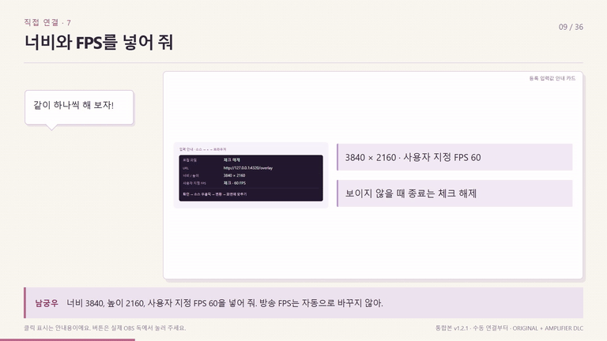
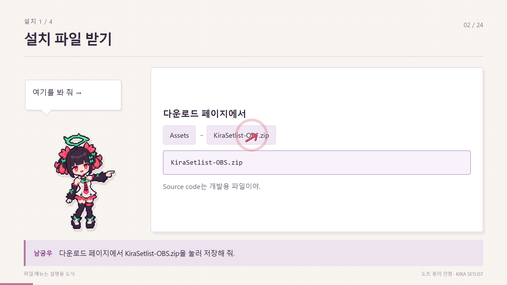
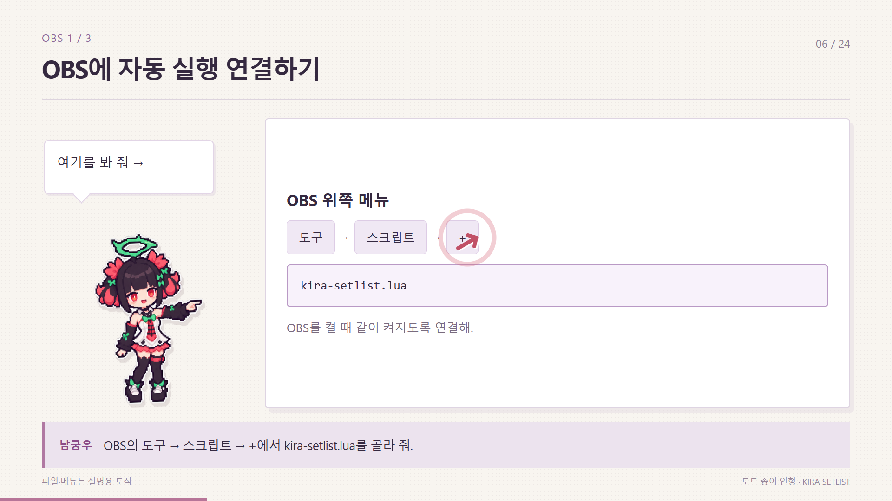
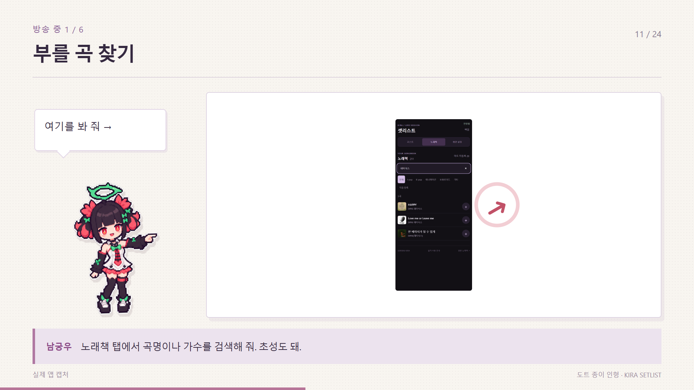

# 도트 남궁우가 움직이며 알려주는 셋리스트 가이드

작은 남궁우가 걸어 들어오고, 손을 흔들고, 파일이나 버튼을 가리킨 뒤 고개를 끄덕여. 8프레임씩 끊어 움직여서 종이 인형을 옮겨 찍은 듯한 느낌으로 만들었어. 원래 오프숄더 의상을 도트로 단순하게 표현했어.

[영상과 이미지 받기](https://github.com/Tenegumi/KiraSetlist/releases/tag/v1.1.0)

- **namgungwoo-tutorial.mp4**: 설치 → OBS 연결 → 곡 추가 → 화면 설정 → 백업까지 24장면, 3분 12초. 소리는 없는 영상이야.
- **KiraSetlist-Pixel-Guide.zip**: 위 영상, 1920×1080 안내 이미지 96장, 자막 SRT, 대사, 움직이는 HTML 원본이 들어 있어.
- HTML 원본의 **index.html**을 열면 설치 없이 재생할 수 있어. 아래 이전·다음 버튼으로 필요한 단계만 볼 수 있어.

영상 편집에 쓸 땐 MP4를 먼저 넣고, subtitles.srt를 불러와 줘. 내레이션을 넣고 싶으면 narration.txt의 대사를 읽으면 돼. 화면 오른쪽이 실제 앱 캡처인 장면에는 ‘실제 앱 캡처’라고 적어 뒀어. 파일 선택과 OBS 메뉴는 따라 하기용 도식이야.

남궁우 그림은 제공된 참고 이미지로 GPT 이미지 생성 도구에서 만든 투명 도트 스프라이트야. 네 가지 포즈에 이동·회전·클릭 표시를 붙여 실제로 움직이도록 구성했어. 큰 일러스트를 교체하는 이전 시안은 이 배포본에 포함하지 않았어.

[생성 프롬프트](PROMPT.json) · [글과 화면을 함께 보는 설치 가이드](../INSTALL.md)
