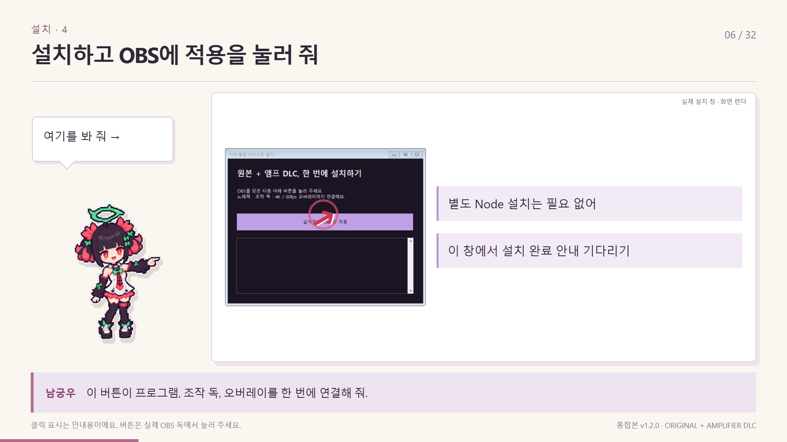
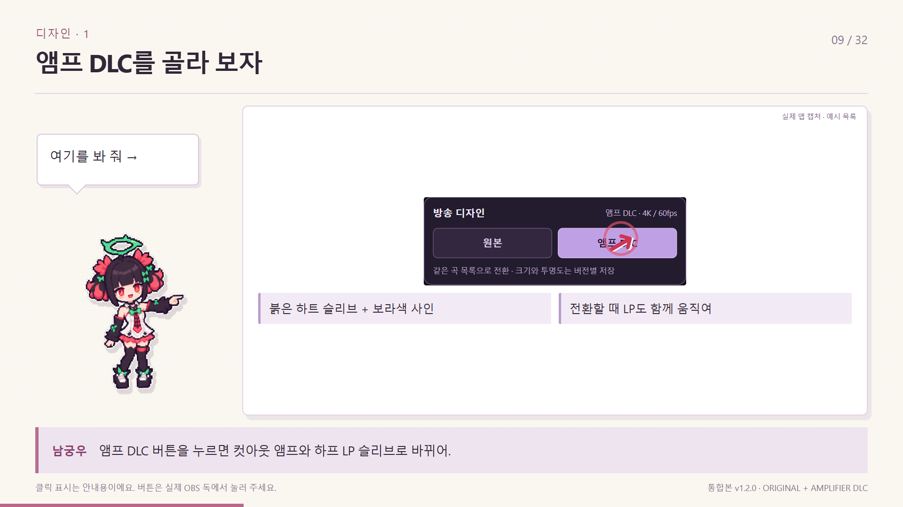
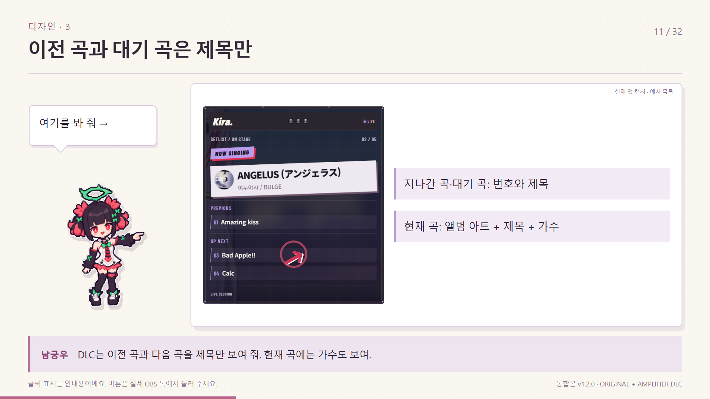
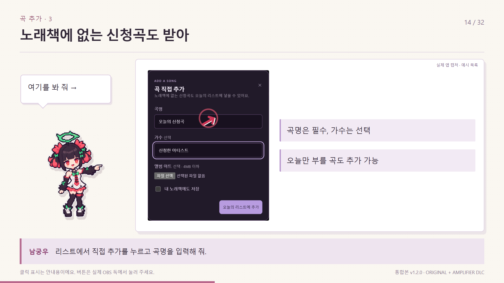
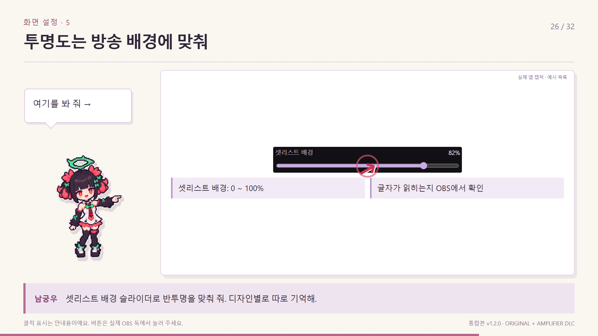

# 남궁우와 시작하는 원본 + 앰프 DLC

설치 버튼부터 오늘의 셋리스트까지, 작은 도트 남궁우가 같이 알려줘요. **현재 통합본 v1.2.0**을 기준으로 다시 만든 안내예요.

**[영상 받기](https://github.com/Tenegumi/KiraSetlist/releases/download/v1.2.0/kira-integrated-tutorial.mp4)** · **[영상·이미지 128장 묶음](https://github.com/Tenegumi/KiraSetlist/releases/download/v1.2.0/KiraSetlist-Integrated-Guide.zip)** · **[그림과 글로 따라 하기](../INSTALL.md)**

영상은 **32장면 · 3분 12초 · Full HD · 무음**이에요. 설치, 원본/DLC 선택, 노래책 검색, 신청곡 직접 추가, 앨범 이미지, 부르기·완료, 표시 곡 수, 크기·투명도, 업데이트·백업을 순서대로 보여줘요.

## 설치 버튼 하나로 연결

## 같은 곡 목록으로 디자인 전환

## DLC 이전·대기 곡은 제목만

## 신청곡도 직접 담기

## 크기·투명도도 내 방송에 맞춰

**이미지 128장**은 32단계 × 4포즈이며 모두 1920×1080이에요. ZIP의 `viewer/index.html`은 단계 선택과 이전·다음 버튼으로 필요한 부분만 볼 수 있어요. 자막 SRT와 내레이션 대사도 함께 들어 있어요.

실제 OBS 출력과 실제 앱 캡처를 사용했어요. 설치 창은 실제 프로그램 화면 렌더, 파일 선택·압축 해제는 안내 카드예요. 도트 캐릭터는 기존 GPT 이미지 생성 스프라이트를 사용했고 이동·회전·포즈 교체로 종이 인형처럼 움직여요. [영상 편집 방법과 화면 구분](../MEDIA.md)
